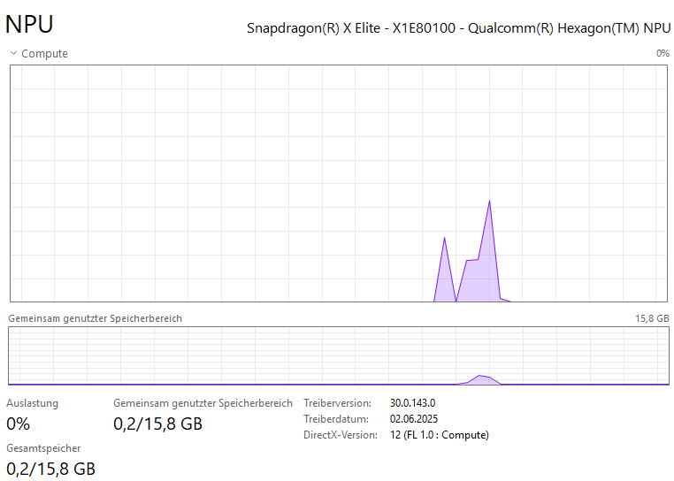

# MCP-with-local-LLM

This project demonstrates running the Phi-3.5-mini-instruct LLM model locally on a Snapdragon Elite X NPU, enhanced with Model Context Protocol (MCP) capabilities.

## Overview

The MCP implementation showcases three key interaction patterns:
- **Tool Execution**: MCP Client calls tools from MCP Server
- **AI-Driven Tool Selection**: MCP Client uses local LLM to intelligently choose which MCP Server tools to invoke
- **Sampling**: MCP Server requests MCP Client to execute prompts

## Prerequisites

1. **Install Python 3.10**

2. **Download and install QNN SDK**  
   Available at [Qualcomm Software Center](https://softwarecenter.qualcomm.com/)

3. **Download Phi-3.5-Mini-Instruct context binaries**  
   Get the `.bin` files from [Qualcomm AI Hub](https://aihub.qualcomm.com/models/phi_3_5_mini_instruct?searchTerm=phi) and extract them to your desired folder (e.g., `C:\LLM\phi_3_5_mini_instruct`)

## Setup

1. **Create a Python virtual environment**

2. **Verify genie_bundle files**  
   Ensure `genie_config.json`, `htp_backend_ext_config.json`, and `tokenizer.json` are in the `genie_bundle` folder

3. **Configure model paths**  
   Open `genie_config.json` and modify the `ctx-bins` (line 50) if necessary to include the downloaded Phi-3 model binaries from prerequisites

4. **Copy QNN SDK files**  
   Locate your QNN SDK installation folder and copy files from these directories (SDK version may vary):
   ```
   <QNN-SDK ROOT>/qairt/2.34.0.250424/lib/hexagon-v75/unsigned
   <QNN-SDK ROOT>/qairt/2.34.0.250424/lib/aarch64-windows-msvc
   <QNN-SDK ROOT>/qairt/2.34.0.250424/bin/aarch64-windows-msvc
   ```
   Paste all copied files into your `genie_bundle` folder

5. **Test the setup** 
   Execute from project root:
   ```powershell
   ./genie_bundle/genie-t2t-run.exe -c genie_bundle/genie_config.json -p "<|system|>\nYou are an assistant. Provide helpful and brief responses.\n<|user|>What is an NPU? \n<|end|>\n<|assistant|>\n"
   ```
   
   **Alternative**: Run the Python script which calls `genie-t2t-run.exe` internally:
   ```powershell
   python call_llm.py
   ```

6. **Verify NPU usage**  
   The LLM should respond and the NPU should show computation activity
   

## Note

The MCP implementation files (`calc_client.py` and `calc_server.py`) are currently work in progress. This README will be updated with detailed MCP usage instructions as soon as possible.